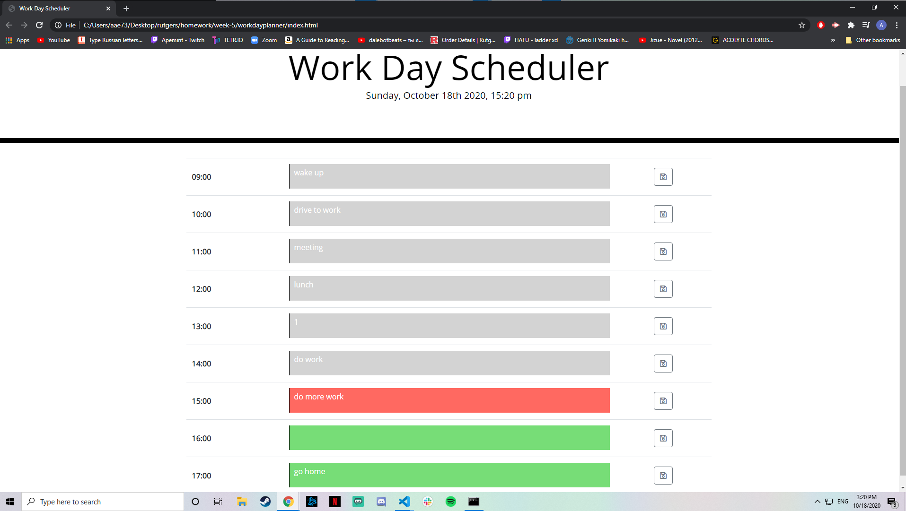

# workdayplanner

This is a simple work day planner browser application.

## Description

This application displays a standard 9-5 workday in hourly timeblocks. The application checks each time block against the current hour, changing the color of the time block to either gray-past, red-present, or green-future. The user can input their own plans into the text area and save them by pressing the save button within the corresponding timblock row. This will save their input onto local storage, so that their input will persist upon leaving or refreshing the site.

## URL
github repo:
https://github.com/apemint/workdayplanner
Deployed app via github pages:
https://apemint.github.io/workdayplanner/

## Improvement for future

One main problem i had when develping the javascript code, was that I wasn't sure how to loop through the ids for each input field and button. This led me to write multiple lines of code for each timeblock instead of creating a function to pass through each one and update content via the loop. In the future I would like to implement a loop to dry up the code.

I also intended on making the header time continously updating every second instead of the static updated time on every refresh. I think this would be possible with a function that runs on a second interval, so it would update the time every second. I decided against this due to time restraints.
